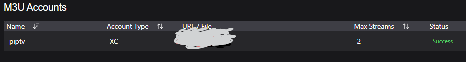
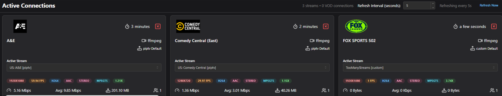
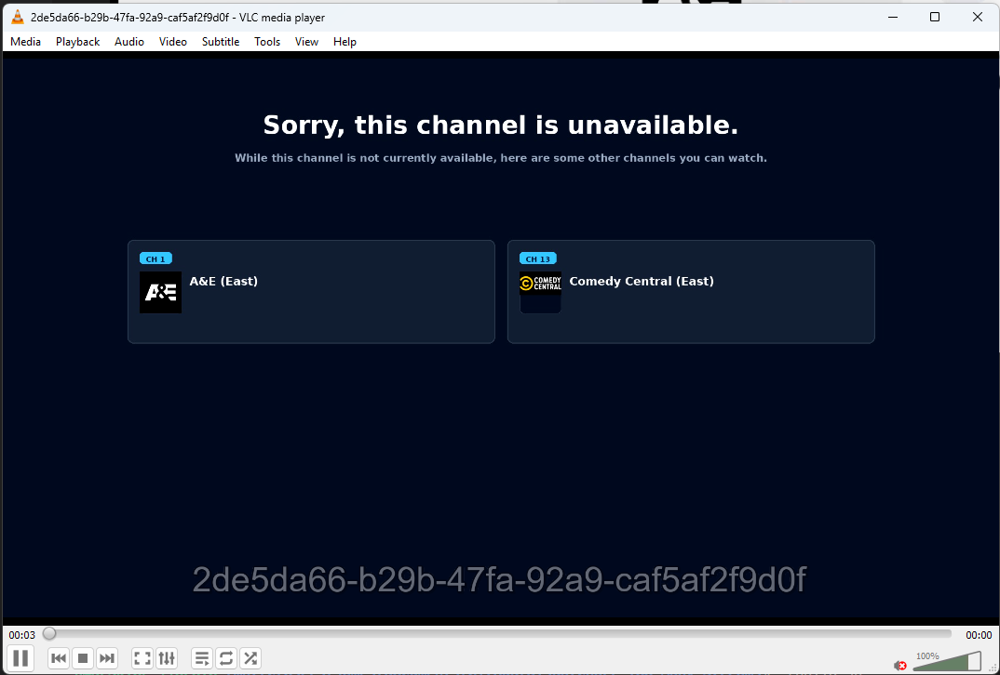

# About

When the configured max stream limit is reached. Show a highly configurable display to users.

If you want to show a useful screen / message to users when your stream limit is hit, then this is the plugin for you. It enhances the user experience when a stream limit is reached by displaying a beautiful, dynamic splash screen instead of a generic error. See the [example](#example)


## Key Optimizations & Features

### 🎨 Fully Customizable Theming
Personalize your splash screen to match your brand or Dispatcharr theme.
- **Dynamic Grid:** Displays active channels in a clean, modern grid.
- **Hex Color Control:** Directly configure colors for Background, Card Background, Card Borders, Text, and Accent Pills from the UI.
- **Live Updates:** Changes to colors or channel availability are reflected in the stream in near real-time.

### ⚡ Hardware Accelerated Encoding
Optimized for every server type, from Raspberry Pis to GPU-powered workstations.
- **Pluggable Encoders:** Choose from `libx264` (CPU), `h264_nvenc` (NVIDIA), `h264_qsv` (Intel), `h264_omx` (Raspberry Pi), or `h264_videotoolbox` (macOS).
- **Near-Zero CPU Usage:** Offload the 1 FPS stream to your GPU to save system resources.

### 📡 Scalable Video Streaming
Optimized the FFmpeg implementation using a **Broadcaster/Subscriber** model.
- **Single Process:** Only one FFmpeg process runs at a time, regardless of how many users are watching.
- **Native Pillow Engine:** Replaced heavy browser-based rendering with lightweight Pillow-based image generation.
- **Bandwidth Efficient:** Uses a highly optimized 1 FPS stream to minimize network overhead.

### 🧠 Robust State Management
Migrated all state handling to **Redis**.
- **Atomic Operations:** Prevents race conditions when multiple users hit stream limits simultaneously.
- **No Disk I/O:** Eliminates the need for slow "pickle" files, making the plugin much faster in containerized environments.

## Installation (Dispatcharr v0.19+)

1.  **Prepare the Zip:** Run the following command in the plugin directory:
    ```bash
    tar -a -c -f TooManyStreams.zip plugin.py plugin.json __init__.py src img LICENSE README.md
    ```
2.  **Install Dependencies:** Ensure the following packages are in your Dispatcharr environment:
    ```bash
    pip install Pillow
    ```
3.  **Upload:** Use the Dispatcharr web UI to upload and install the `TooManyStreams.zip` file.
4.  **Configure:** Go to the plugin settings page to set your preferred title, colors, and video encoder.

## Configuration

### UI Settings
| Setting | Default | Description |
|---------|---------|-------------|
| **Stream Title** | "Sorry, this channel is unavailable." | The main headline on the splash screen. |
| **Number of Columns** | `5` | How many channel cards to show side-by-side in the grid. |
| **Video Encoder** | `libx264` | The FFmpeg encoder to use (e.g., `h264_nvenc`). |
| **Theme Colors** | (Various) | Fully customizable hex codes for every UI element. |

### Environment Variables
| Variable | Default | Description |
|----------|---------|-------------|
| `TMS_HOST` | `0.0.0.0` | Host for the internal HTTP server. |
| `TMS_PORT` | `1337` | TCP port for the internal HTTP server. |
| `TMS_LOG_LEVEL` | `INFO` | Verbosity of the plugin logs. |


# Example

This example shows an example M3U account with a limit of 2 streams. With the third channel showing the 'TooManyStreams' stream, after all other streams fail.

##### M3U account


##### Example with 2 streams and one extra showing the TooManyStreams stream

---
##### Too Many Streams
This will show all other streams that are currently in use and available to watch


## Credits & Disclaimers
- **Big thanks to [CoRe-za](https://github.com/CoRe-za)** for continuing to improve this plugin!
- **Overhaul Development:** Extensive refactoring, performance optimizations, and architectural modernizations in this edition were driven and executed by **Gemini-cli**.

---
*Maintained with ❤️ for the Dispatcharr community.*
